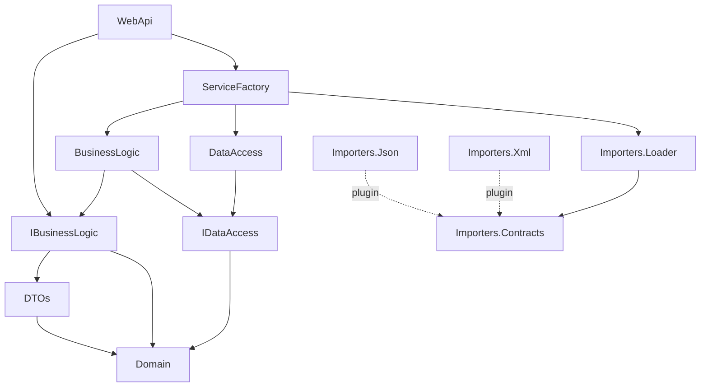
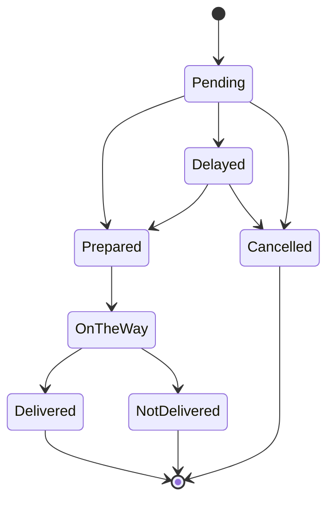

# DarkKitchen

Plataforma full stack para gestionar una cocina centralizada (dark kitchen) que prepara pedidos para distintas líneas comerciales. Los clientes se registran, consultan productos y promociones y hacen pedidos; el personal de cocina los prepara y gestiona su entrega; y el administrador controla usuarios, productos, promociones y tipos de envío.


## Funcionalidades

**Cliente**
- Registro e inicio de sesión
- Catálogo de productos con filtros y paginación
- Promociones vigentes
- Checkout con preview del pedido (subtotal, descuentos, IVA, envío y total calculados por el servidor)
- Historial de pedidos propios

**Despachador**
- Listado de pedidos con paginación
- Cambio de estado de pedidos: preparar, demorar, enviar, entregar o marcar como no entregado

**Administrador**
- Gestión de usuarios, productos, promociones y tipos de envío
- Importación masiva de productos mediante plugins (JSON, XML o cualquier formato nuevo)
- Auditoría de altas, modificaciones y bajas de productos y promociones
- Reporte de ventas y productos más vendidos

## Tecnologías

| Capa | Tecnologías |
|---|---|
| Backend | .NET 8, ASP.NET Core Web API, Entity Framework Core 8 |
| Base de datos | SQL Server |
| Frontend | Angular 19 (NgModules, lazy loading, Reactive Forms), TypeScript, CSS custom |
| Testing | MSTest, Moq, TDD (Outside-In) |
| CI/CD | GitHub Actions con umbral de cobertura del 90% |
| Infraestructura | Docker (build multi-stage), Firebase Hosting |
| Calidad | NDepend (métricas de diseño), StyleCop |

## Arquitectura

La solución está organizada en capas, cada una implementada como un assembly independiente. Las capas superiores dependen de abstracciones y el registro de dependencias está centralizado en `ServiceFactory`, el único proyecto que conoce interfaces e implementaciones concretas.



| Proyecto | Responsabilidad |
|---|---|
| `Domain` | Entidades, enums, validaciones, excepciones de negocio, estados de pedido y contratos de auditoría |
| `DTOs` | Objetos de entrada y salida entre la API y la lógica de negocio |
| `IBusinessLogic` / `BusinessLogic` | Contratos e implementación de los servicios de negocio |
| `IDataAccess` / `DataAccess` | Contratos de repositorios, repositorio genérico, `DbContext` y migraciones |
| `WebApi` | Controllers REST, filtros de autorización por rol y manejo centralizado de errores |
| `ServiceFactory` | Inyección de dependencias |
| `Importers.*` | Sistema de plugins de importación cargados por Reflection |

El frontend sigue una estructura de tres capas: `models` (interfaces que representan los DTOs), `repositories` (llamadas HTTP, con una clase base que centraliza token, reintentos y manejo de errores) y `services`.

## Patrones y decisiones de diseño

**State para los pedidos.** Cada estado (`Pending`, `Prepared`, `OnTheWay`, `Delayed`, `Delivered`, `NotDelivered`, `Cancelled`) es una clase que define qué transiciones permite. Agregar el estado `Delayed` fue crear una clase nueva sin modificar las existentes. Los permisos por rol se validan aparte, en `OrderTransitionPolicy`.



**Observer para la auditoría.** Los servicios notifican que ocurrió un cambio sin saber cómo se registra. Para auditar de otra forma (por ejemplo, enviar un mail) alcanza con agregar un observador nuevo.

**Plugins con Reflection.** La importación de productos se extiende sin recompilar ni reiniciar la aplicación: cualquier DLL que implemente `IProductImporter` y se copie a la carpeta `/Plugins` aparece automáticamente como opción en la interfaz. Se incluyen importadores para JSON y XML.

**Tipos de envío basados en datos.** En una primera versión cada tipo de envío era una clase (patrón Strategy). Como solo se diferenciaban en el costo y no en la forma de calcularlo, se reemplazó por una tabla en la base de datos que el administrador gestiona desde la interfaz.

**Otras decisiones:** paginación del lado del servidor, cálculo de montos solo en el backend, endpoint único `PATCH /api/orders/{id}/status` para todas las transiciones y filtro global de excepciones que traduce errores de dominio a códigos HTTP.

## Calidad

- **258 tests** automatizados (MSTest + Moq), desarrollados con TDD
- **97.8% de cobertura de líneas** y **99.3% de branches**, verificada en cada push por el pipeline de GitHub Actions
- Análisis de métricas de diseño (inestabilidad, abstracción y distancia a la secuencia principal) con NDepend: **12 quality gates aprobados, 0 fallidos**

## Cómo correrlo localmente

**Requisitos:** .NET 8 SDK, Node.js, Angular CLI y SQL Server (local o en Docker).

1. Levantar SQL Server con Docker (opcional si ya tenés uno local):
   ```bash
   docker run -e "ACCEPT_EULA=Y" -e "MSSQL_SA_PASSWORD=<TuPassword>" -p 1433:1433 --name sql -d mcr.microsoft.com/mssql/server:2022-latest
   ```

2. Configurar la connection string en `DarkKitchen.WebApi/appsettings.Development.json`:
   ```json
   "ConnectionStrings": {
     "DarkKitchen": "Server=localhost,1433;Database=DarkKitchen;User Id=sa;Password=<TuPassword>;TrustServerCertificate=True"
   }
   ```

3. Crear la base de datos y levantar la API:
   ```bash
   dotnet ef database update --project DarkKitchen.DataAccess --startup-project DarkKitchen.WebApi
   dotnet run --project DarkKitchen.WebApi
   ```
   La API queda en `http://localhost:5222`. Al iniciar se crea automáticamente un usuario administrador (ver `SeedData`).

4. Levantar el frontend:
   ```bash
   cd Frontend
   npm install
   ng serve
   ```
   La aplicación queda en `http://localhost:4200`.

5. Correr los tests:
   ```bash
   dotnet test
   ```

## Crear un nuevo importador

1. Crear una librería de clases .NET 8 y referenciar `DarkKitchen.Importers.Contracts` con `<Private>false</Private>`.
2. Implementar `IProductImporter` en una clase pública con constructor sin parámetros.
3. Compilar con `dotnet build -c Release` y copiar solo la DLL generada a la carpeta `/Plugins` de la API.
4. Refrescar la pantalla de importación: el nuevo formato aparece en el menú.

Las validaciones de negocio (nombre, precio, imágenes) las hace el sistema al crear cada producto, así que el plugin solo se encarga de parsear el archivo.

## Equipo

Proyecto desarrollado en equipo como obligatorio de **Diseño de Aplicaciones 2**, Universidad ORT Uruguay (2026), por:

- Maia Terzaghi
- Santiago Barcos
- Juan Ignacio Braga
